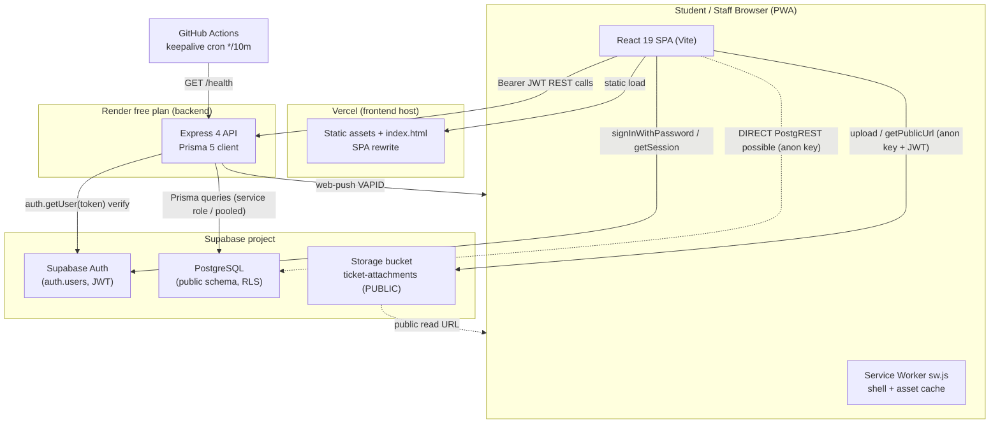

# ABUAD SRC Portal — Technical Audit (Part 1 of 5)

> **Scope of this file:** Executive Summary · Current Architecture · Repository Structure · Frontend Audit
> **Other parts:** `AUDIT 2.md` (Backend, Auth, RBAC, DB, RLS) · `AUDIT 3.md` (Workflow, Storage, Notifications, PWA, API Security) · `AUDIT 4.md` (Performance, Scalability, Migrations) · `AUDIT 5.md` (Security Findings, Reliability, A11y, Testing, Deployment, Recommendations, Score)

**Audit type:** Read-only reconnaissance. No application code, dependencies, infrastructure, or configuration was modified.
**Commit audited:** `7acdd4f050d3c01b088fd9be407ba1a1b4802fb5`
**Evidence labels used throughout:** `CONFIRMED` (seen directly in code), `LIKELY`, `POSSIBLE`, `UNABLE TO VERIFY`, `RECOMMENDATION`.

---

## 1. Executive Summary

### Current state

The ABUAD SRC Portal is a **monorepo** with a clean two-tier split:

- **Frontend** (`frontend/`): React 19 + Vite 8 + Tailwind CSS 4, deployed to **Vercel**. Talks to Supabase Auth and Supabase Storage directly from the browser, and to the custom API for all business data.
- **Backend** (`backend/`): Express 4 + Prisma 5 API deployed to **Render (free plan)**. It owns all reads/writes of business data (tickets, comments, notifications, admin actions) through Prisma against **Supabase PostgreSQL**.
- **Auth:** Supabase Auth (email/password) in the browser; the backend verifies the Supabase JWT on every protected request and re-derives the user's role from the `profiles` table server-side.
- **Storage:** Supabase Storage, single **public** bucket `ticket-attachments`, uploaded to directly from the browser under a per-user folder namespace.
- **Notifications:** In-app (a `notifications` table) plus **Web Push (VAPID)** via the `web-push` library, generated server-side inside API handlers.
- **PWA:** Custom `manifest.webmanifest` and hand-written service worker (`frontend/public/sw.js`).

This is a genuine, reasonably mature 2-tier architecture — **not** the "everything in the browser with the anon key" pattern the code comments say it replaced. Authorization is overwhelmingly enforced **server-side** in Express, which is the correct trust boundary.

### Biggest problems (top 5)

1. **`profiles` UPDATE RLS policy does not protect the `role` column (privilege escalation).** `CONFIRMED` from policy text; `LIKELY` exploitable. The policy `profiles_update_own` only checks `id = auth.uid()`. Because the browser holds the Supabase anon key and a valid user JWT, a student can call PostgREST directly (`supabase.from('profiles').update({ role: 'SUPER_ADMIN' })`) and RLS will allow it. The Express API is safe, but the database is directly reachable. See `AUDIT 2.md` §RLS and `AUDIT 5.md` P0-1.
2. **Render free-tier cold starts** (~30–60s) are the most likely cause of the "portal feels broken on first tap" complaint. A GitHub Actions keep-alive exists but is explicitly best-effort. See `AUDIT 4.md` §Render.
3. **Announcement / broadcast fan-out is O(students)** — it loads every active student ID into memory, does one `createMany`, then fans out push in chunks of 50 inside the request. At 10,000 students this is a long-running request on a single free-tier instance. See `AUDIT 3.md` §Notifications and `AUDIT 4.md` §Scalability.
4. **No automated tests of any kind** and **no error tracking / structured logging / audit-log writes wired to routes** were found. Production observability is effectively console logs on Render. See `AUDIT 5.md` §Testing/§Observability.
5. **Public storage bucket + MIME allowlist drift.** The bucket is public (anyone with the URL can read), and the allowed MIME lists disagree across three layers (bucket allows HEIC, backend Zod rejects HEIC but allows GIF). See `AUDIT 3.md` §Storage.

### Security — most serious risks

- **P0:** `profiles.role` writable via RLS (privilege escalation) — see above.
- **P1:** Direct-to-PostgREST write surface generally — every table with a permissive `with check` needs re-examination assuming the browser can call it directly, not just the Express API.
- **P1:** Public storage bucket exposes all attachments to anyone with a URL; deletion/orphan lifecycle is client-driven.
- **P2:** No security headers on the Vercel-served frontend (no CSP/HSTS/X-Frame-Options/Referrer-Policy). `helmet()` protects the API responses only.
- Positives: Zod validation replaces raw `req.body` (blocks mass assignment via the API), server-side status-transition state machine, IDOR-resistant `getTicketOrThrow`, error handler that hides stack traces in production, CORS allowlist, and per-route rate limiting.

### Performance — most likely cause of slow loading

`CONFIRMED`/`LIKELY`: **Render free-plan cold start.** The frontend is code-split (every page is `React.lazy`), assets are fingerprinted and cached immutably, and the SW serves an app shell — so the *frontend* first paint should be fast. The stall users feel is the **first API call waking the Render container**, compounded by `/health` and every DB call sharing one pooled connection (`connection_limit=1` in the example `DATABASE_URL`).

### Scalability — what fails first at 10,000 students

`LIKELY`, in order:
1. **Broadcast fan-out** (announcements to all students) — synchronous, in-request, memory-bound.
2. **Single Render free instance** — no horizontal scale, one process, cold starts.
3. **Postgres connection ceiling** — pooled string shows `connection_limit=1`; concurrent requests serialize on it.
4. **Offset pagination** (`skip/take`) on tickets/notifications degrades as tables grow, plus a `count(*)` per list call.

### Render — should the Node API move to Vercel?

**CONDITIONAL.** The Express app is mostly stateless and portable, but it is a single Express server with in-memory settings cache and long-running push fan-out. Moving to Vercel Functions is feasible for most endpoints but requires refactoring the broadcast path to a queue/cron and accepting per-invocation cold starts of its own. See `AUDIT 4.md` §Vercel. The immediate "slowness" fix is a paid always-on instance, not necessarily a platform migration.

### Database — keep Supabase Postgres or move to Neon?

**NO (keep Supabase), CONDITIONAL at best.** The app leans on Supabase-specific pieces: `auth.users`, `auth.uid()` in RLS, the `handle_new_user()` trigger on `auth.users`, and Supabase Storage. Neon has none of these. Moving to Neon would **not** solve the identified bottlenecks (cold start, fan-out, connection limit) and would force you to replace Supabase Auth simultaneously. See `AUDIT 4.md` §Neon.

### Auth — keep Supabase Auth or move to Firebase?

**NO technical justification identified from the repository.** Supabase Auth is cleanly integrated, the backend already verifies tokens server-side, and RLS + triggers are bound to `auth.uid()`. Firebase would require rebuilding token verification, the signup→profile trigger, the email-domain enforcement trigger, and every RLS predicate. See `AUDIT 4.md` §Firebase.

### Storage — keep Supabase Storage or move?

**CONDITIONAL.** For the expected volume (≤5 images/ticket, ≤5 MB each), Supabase Storage is functionally sufficient. The real issues are *privacy* (public bucket) and *lifecycle* (client-side deletes → orphans), which a move to Cloudinary/R2 with signed URLs would help — but you can also fix them on Supabase by making the bucket private and issuing signed URLs. See `AUDIT 4.md` §Storage.

### Overall production-readiness score

**58 / 100.** A well-structured, security-conscious 2-tier app with genuinely good patterns (server-side authz, Zod, transactions, sensible SW caching). Held back from production-grade by: one **P0 privilege-escalation** in RLS, **no tests**, **no observability**, **free-tier hosting with cold starts**, and **broadcast fan-out that won't scale**. Fixing the P0 and the fan-out, adding tests + error tracking, and moving off the free Render plan would put this comfortably in the 75–85 range. Full breakdown in `AUDIT 5.md`.

---

## 2. Current Architecture

`CONFIRMED` from `server.js`, `frontend/src/lib/*`, `render.yaml`, `frontend/vercel.json`, and the Prisma schema/SQL.



**Trust boundaries**

- The **security-critical boundary is the Express API**, which verifies the Supabase JWT (`supabaseAdmin.auth.getUser(token)`) and re-reads the role from `profiles`. `CONFIRMED` in `backend/src/middleware/auth.js`.
- The **dotted lines are the risk**: because the browser has the Supabase anon key and a live session, it can bypass Express and hit **PostgREST** and **Storage** directly. Those paths are governed only by **RLS** and **Storage policies**, so any weakness there (see the `profiles.role` finding) is directly reachable by an authenticated student.

**Deployment architecture**

| Tier | Host | Config file | Notes |
|---|---|---|---|
| Frontend | Vercel | `frontend/vercel.json` | SPA rewrite (all non-`/assets/` → `index.html`); long cache for `/assets/*`; `sw.js` `max-age=0, must-revalidate`. No security headers. |
| Backend | Render (free) | `render.yaml` | `rootDir: backend`, `npm ci` → `npm start`, health check `/health`, secrets `sync:false`. Free plan idles after ~15 min. |
| DB/Auth/Storage | Supabase | `backend/prisma/sql/*.sql`, `backend/prisma/schema.prisma` | Pooled `DATABASE_URL` (6543, pgbouncer, `connection_limit=1` in example), `DIRECT_URL` (5432) for migrations. |
| Keep-alive | GitHub Actions | `.github/workflows/keepalive.yml` | Cron `*/10 * * * *` pings `/health`; explicitly "best-effort". |

---

## 3. Repository Structure

`CONFIRMED` from directory listings.

```
abuad-src-portal/
├─ package.json                 # workspace root (npm workspaces)
├─ render.yaml                  # Render blueprint (backend)
├─ README.md / PROD.md / SETUP.md / API.md
├─ .github/workflows/keepalive.yml
│
├─ backend/
│  ├─ server.js                 # Express bootstrap, middleware order, routers, graceful shutdown
│  ├─ package.json              # Node 22.x; express, prisma, supabase-js, zod, helmet, web-push...
│  ├─ prisma/
│  │  ├─ schema.prisma          # Prisma models (Profile, Ticket, Comment, Vote, Rating, Notification, Announcement, Poll, Department, AppSettings, AuditLog, PushSubscription, SavedView...)
│  │  └─ sql/                   # Hand-written SQL run in Supabase SQL editor:
│  │     ├─ 01_post_migration.sql   # FKs, triggers, RLS enable + core policies, is_staff(), seeds
│  │     ├─ 02_storage.sql          # bucket + storage.objects policies
│  │     ├─ 03_add_department_changed_event.sql
│  │     ├─ 04_phase4.sql           # is_super_admin(), write policies, rating CHECK, poll count trigger
│  │     └─ 05_phase5.sql           # profiles.department_id, departments.category
│  ├─ scripts/                  # check-db.mjs, smoke-routes.mjs
│  └─ src/
│     ├─ config/env.js          # required()/optional() env loader
│     ├─ middleware/            # auth.js, errorHandler.js, maintenance.js, rateLimiter.js, validate.js
│     ├─ routes/                # authRoutes, ticketRoutes, departmentRoutes, notificationRoutes, announcementRoutes, adminRoutes
│     ├─ services/              # ticketService, pushService, settingsService, domainPolicy
│     └─ validators/            # authSchemas, ticketSchemas, notificationSchemas (Zod)
│
└─ frontend/
   ├─ index.html               # title, description, theme-color, manifest link, OG tags
   ├─ vite.config.js           # react + tailwind plugins (no manualChunks)
   ├─ vercel.json              # rewrites + cache headers
   ├─ eslint.config.js
   ├─ public/
   │  ├─ sw.js                 # service worker (shell/asset/nav caching + push)
   │  └─ manifest.webmanifest
   ├─ scripts/                 # generate-icons.mjs, add-dark-variants.mjs
   └─ src/
      ├─ main.jsx / App.jsx    # lazy routes + Suspense
      ├─ context/              # AuthContext, ThemeContext
      ├─ components/           # Layout, RouteGuards, NotificationBell, AttachmentPicker, TicketFilters, StaffControls, ResolutionActions, ThemeToggle, NotificationSettings, Logo...
      ├─ hooks/                # useTickets, usePushNotifications
      ├─ lib/                  # api.js, supabase.js, uploads.js, registerSW.js
      └─ pages/                # Home, Login, Signup, ForgotPassword, ResetPassword, Dashboard, TicketList, TicketDetail, NewTicket, Profile, AdminDashboard, Analytics, UserManagement, Moderation, PortalSettings, Announcements, TrackTicket, NotFound, Forbidden
```

**Dependency inventory**

Backend (`backend/package.json`, Node `22.x`):

| Package | Version | Purpose | Note |
|---|---|---|---|
| express | ^4.19.2 | HTTP framework | Stable |
| @prisma/client / prisma | ^5.15.0 | ORM + migrations | `postinstall` runs `prisma generate` |
| @supabase/supabase-js | ^2.45.4 | JWT verify (`auth.getUser`) | Backend uses service/admin client |
| zod | ^3.23.8 | Request validation | Good |
| helmet | ^7.1.0 | API security headers | API only |
| cors | ^2.8.5 | CORS allowlist | Good |
| compression | ^1.7.4 | gzip | Fine |
| express-rate-limit | ^7.3.1 | Rate limiting | **In-memory store** (per-instance) |
| web-push | ^3.6.7 | VAPID push | Degrades to no-op if keys absent |
| dotenv | ^16.4.5 | Env | — |

Frontend (`frontend/package.json`):

| Package | Version | Purpose | Note |
|---|---|---|---|
| react / react-dom | ^19.2.7 | UI | Very new major |
| react-router-dom | ^7.18.2 | Routing | Very new major |
| @supabase/supabase-js | ^2.112.2 | Auth + Storage in browser | **Version drift vs backend `^2.45.4`** |
| recharts | ^3.9.2 | Analytics charts | Large; lazy-loaded via Analytics page |
| lucide-react | ^1.24.0 | Icons | Tree-shakeable |
| tailwindcss / @tailwindcss/vite | ^4.3.2 | Styling | Tailwind v4 |
| vite | ^8.1.1 | Bundler | Very new major |
| sharp | 0.35.3 (dev) | Icon generation script only | Not shipped |

**Dependency observations** (`RECOMMENDATION`, no upgrades performed):
- **supabase-js version drift** (`2.112` front vs `2.45` back). Not harmful today but worth aligning to avoid subtle auth/JWT behaviour differences.
- **`recharts` is the heaviest runtime dependency.** It is correctly isolated to the lazy `Analytics` page, so it does not bloat the initial student bundle. `CONFIRMED` via `App.jsx` lazy imports.
- No obviously abandoned or duplicated libraries. No client-side data-fetching library (React Query/SWR) — data fetching is hand-rolled with `fetch` + `AbortController` (see Frontend audit).
- `express-rate-limit` uses the default **in-memory** store — limits are **per-instance** and reset on cold start (relevant if you scale out or move to Functions).

---

## 4. Frontend Audit

### 4.1 Architecture & routing

- **React 19** SPA, **React Router 7**. `CONFIRMED`.
- **Code splitting:** every page is `React.lazy(() => import(...))` and wrapped in a single `<Suspense fallback={<FullPageSpinner/>}>`. `CONFIRMED` in `frontend/src/App.jsx` (lines 29–47, 57–121). This is the single biggest reason the initial bundle stays small — admin/analytics/recharts code is not shipped to students on first load.
- **Route guards:** `frontend/src/components/RouteGuards.jsx` gate routes on auth/role state from `AuthContext`. **These are UX-only** (they hide/redirect); the real enforcement is the API (correct design, documented in the code comments themselves).

### 4.2 State management & auth state

- **`AuthContext`** (`frontend/src/context/AuthContext.jsx`) is the central store. `CONFIRMED`:
  - `supabase.auth.getSession()` on mount, then `supabase.auth.onAuthStateChange(...)` to react to login/logout/token refresh.
  - Role is **not** trusted from the client token; it's fetched from `GET /api/auth/me` (server reads `profiles`). Flags `isAdmin`, `isStaff`, `isSuperAdmin`, `role` are derived from that server response (lines 218–224). This is the right pattern.
  - `signIn` (signInWithPassword), `signOut`, `resetPasswordForEmail`, `updateUser({password})` are wired here.
- **`ThemeContext`** for dark mode. No heavyweight global store (no Redux/Zustand) — appropriate for the app size.

### 4.3 API communication

- `frontend/src/lib/api.js`: `BASE_URL = import.meta.env.VITE_API_URL || 'http://localhost:5000'`. Adds `Authorization: Bearer <token>` from the Supabase session. `CONFIRMED`.
- **No request timeout and no retry/backoff** in the API client. `CONFIRMED` (no `timeout`/`retry` found). Combined with Render cold starts, the first call can hang for the full cold-start duration with no client-side deadline. `RECOMMENDATION`: add an `AbortController` timeout + a single retry for idempotent GETs.
- **`AbortController`** is used correctly in `useTickets.js` and `NotificationBell.jsx` to cancel in-flight requests on unmount/param change. `CONFIRMED` — good practice, avoids setState-after-unmount and duplicate renders.

### 4.4 Data fetching, caching, pagination

- **`useTickets`** fetches on mount and when URL search params change; it patches a single ticket in place after a vote instead of refetching the whole list (`CONFIRMED`, comment at line 56) — a nice, deliberate optimization.
- **No client cache layer** (no React Query/SWR). Each page mount re-fetches. For this app that's acceptable, but there is **no request de-duplication** across components. `RECOMMENDATION`.
- **Pagination is offset-based** end-to-end (`page`/`limit` → `skip`/`take` on the server). Fine at small scale; see `AUDIT 4.md` for the at-scale caveat.

### 4.5 Notifications on the client

- **`NotificationBell.jsx` polls `GET /api/notifications` every 60 seconds** (`POLL_MS = 60_000`, `setInterval`). `CONFIRMED`.
  - At 10,000 students each with the app open, this is ~10,000 requests/minute of baseline load on a single free Render instance, each doing 2× `count()` + a `findMany`. This is a real scalability concern independent of spikes. See `AUDIT 4.md`.
  - `RECOMMENDATION`: rely on Web Push for real-time and fetch on focus/visibility rather than a fixed interval, or increase the interval and add backoff.

### 4.6 Forms, validation, image handling

- **`AttachmentPicker.jsx`**: `accept="image/jpeg,image/png,image/webp,image/heic"`, `MAX_FILES` enforced client-side, size hint "up to 5 MB each". Validation helpers `validateFile`, `formatBytes`, `MAX_FILES` live in `frontend/src/lib/uploads.js`. `CONFIRMED`.
- **No client-side image compression/resizing** was found (no `canvas`/`toBlob`/`createImageBitmap`). `CONFIRMED` (search returned nothing). Users on phones may upload full-resolution photos up to the 5 MB cap; there's no downscaling before upload. `RECOMMENDATION` (also a bandwidth/storage cost consideration in `AUDIT 4.md`).
- **Uploads go straight to Supabase Storage from the browser** (`uploads.js` → `supabase.storage.from('ticket-attachments').upload(...)`), then the returned `storagePath` is submitted to the API as part of the ticket. Client validation of type/size is **not** a security control (see Storage audit for the server/bucket-side story).

### 4.7 Error & loading states

- **Loading:** `Suspense` fallback for route chunks; individual pages manage their own loading flags.
- **Error boundaries: none found.** `CONFIRMED` — no `ErrorBoundary`/`componentDidCatch` anywhere under `frontend/src`. A render error in any lazy page will blank the app rather than showing a recoverable fallback. `RECOMMENDATION`: add a top-level error boundary inside the `Suspense`.

### 4.8 PWA integration (client side)

- `registerSW.js` registers the service worker; `vercel.json` serves `sw.js` with `max-age=0, must-revalidate` so updates are picked up. `CONFIRMED`. Full SW behaviour analysed in `AUDIT 3.md` §PWA.

### 4.9 Frontend performance risks (summary — files named)

| Risk | Evidence (file) | Impact |
|---|---|---|
| 60s notification polling for every open client | `components/NotificationBell.jsx` (`POLL_MS`, `setInterval`) | Baseline load scales with concurrent users, not events |
| No API timeout/retry | `lib/api.js` | First-call hang during Render cold start |
| No image downscaling before upload | `components/AttachmentPicker.jsx`, `lib/uploads.js` | Larger uploads, more storage/bandwidth |
| No client cache / dedup | `hooks/useTickets.js` (and pages) | Redundant refetches on navigation |
| No error boundary | `frontend/src/*` | One render error blanks the SPA |
| No `manualChunks` in Vite | `vite.config.js` | Relies solely on route-level splitting; vendor chunking is default-only |

**Positives (frontend):** route-level code splitting, `AbortController` usage, server-derived roles (no trusted client role), immutable asset caching, and a service worker that deliberately never caches `/api` or Supabase responses.

*Continued in `AUDIT 2.md` — Backend, Authentication, Authorization/RBAC, Database, and RLS.*
