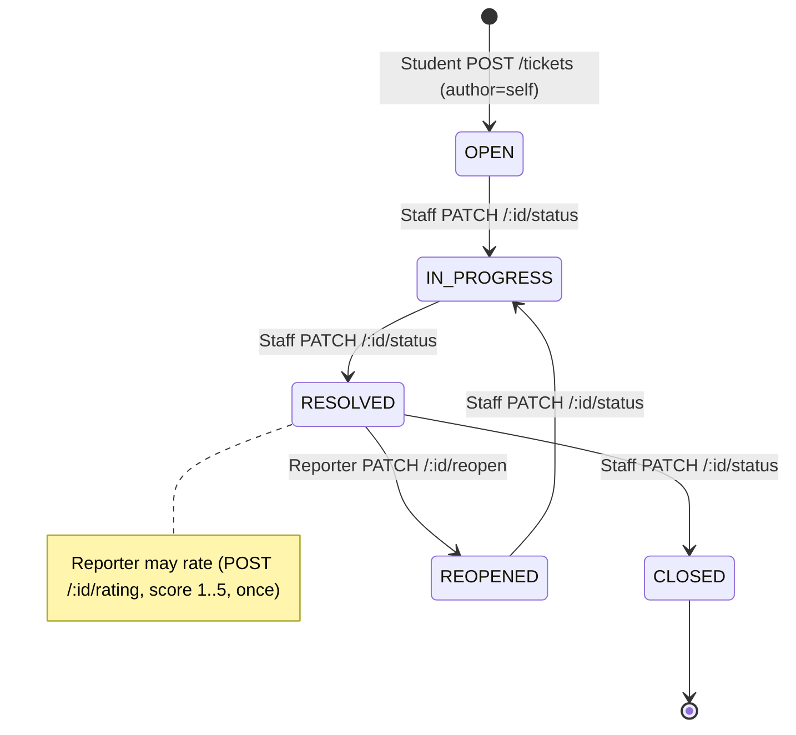

# ABUAD SRC Portal — Technical Audit (Part 3 of 5)

> **Scope of this file:** Complaint Workflow · Image Upload / Storage Security · Notifications · PWA · API Security (headers, CORS, rate limiting, validation)
> **Prev:** `AUDIT 2.md` · **Next:** `AUDIT 4.md`

---

## 10. Complaint (Ticket) Workflow Audit

Sources: `backend/src/services/ticketService.js`, `backend/src/routes/ticketRoutes.js`, `backend/src/validators/ticketSchemas.js`, `frontend/src/pages/NewTicket.jsx`, `TicketDetail.jsx`, `TrackTicket.jsx`, `components/ResolutionActions.jsx`, `StaffControls.jsx`.

### 10.1 Lifecycle discovered



- Actual status values and legal transitions are defined by the **state machine in `ticketService`** and validated by `updateTicketStatusSchema`. `CONFIRMED` that transitions are **server-side enforced** (not just UI), and staff-only for status changes.
- **Creation:** `POST /tickets` sets `author_id` from `req.user.id` (server), not from the body — a student cannot create a ticket "as" someone else through the API. `CONFIRMED`.
- **Attachments:** uploaded to Storage from the browser first (`lib/uploads.js`), then `storage_path`(s) are submitted with the ticket; the server records `ticket_attachments`. `CONFIRMED`.
- **Anonymity:** `is_anonymous` tickets have `author_id` redacted by the **API serializer**; only Admin `POST /tickets/:id/reveal` can de-anonymize. `CONFIRMED` (server-enforced at the API). Caveat: direct PostgREST reads expose `author_id` (see `AUDIT 2.md` §9 — anonymity is not enforced at the RLS layer). `POSSIBLE` leak.
- **Reopen / rating:** reporter-only, guarded by `interactionLimiter`. Rating is once-per-ticket (unique `ticket_id`) and range-checked (CHECK 1..5). `CONFIRMED`.

### 10.2 Transition safety

| Question | Finding |
|---|---|
| Can a student skip states / self-resolve? | ❌ No — status changes require `requireStaff`. `CONFIRMED`. |
| Can a student revert states? | Only `RESOLVED → REOPENED` via `/reopen` (reporter). `CONFIRMED`. |
| Are transitions validated server-side? | ✅ Yes — state machine + Zod. `CONFIRMED`. |
| Duplicate submissions (double-click)? | **No idempotency key.** Rapid double-POST can create two tickets; only `createTicketLimiter` throttles. `LIKELY` minor duplication risk. `RECOMMENDATION`. |
| Two staff editing same ticket simultaneously? | **No optimistic locking / version column** found. Last-write-wins; a status update could clobber a concurrent assignment. `LIKELY` race at high staff concurrency. `RECOMMENDATION`: add a `version`/`updated_at` guard. |
| Are votes/comments race-safe? | Counters maintained by DB triggers on insert/delete → atomic at the row level. `CONFIRMED` reasonable. |

---

## 11. Image Upload / Storage Security Audit

Sources: `frontend/src/lib/uploads.js`, `frontend/src/components/AttachmentPicker.jsx`, `backend/prisma/sql/02_storage.sql`, `backend/src/validators/ticketSchemas.js`.

### 11.1 Bucket configuration `CONFIRMED`

`02_storage.sql`:
```
bucket id/name: ticket-attachments
public: TRUE
file_size_limit: 5242880  (5 MB)
allowed_mime_types: image/jpeg, image/png, image/webp, image/heic
```

### 11.2 Upload path & authorization

- Browser uploads directly: `supabase.storage.from('ticket-attachments').upload(path, file, ...)` where `path = <user-id>/<uuid>.<ext>` (`uploads.js` line ~50). `CONFIRMED`.
- Storage policies (`02_storage.sql`) confine writes to the user's own folder by comparing the **first path segment to `auth.uid()`**:
  - `ticket_attachments_insert_own` (INSERT, authenticated)
  - `ticket_attachments_update_own` (UPDATE, authenticated)
  - `ticket_attachments_delete_own` (DELETE, authenticated)
  - `ticket_attachments_read_public` (SELECT, **public**)
  `CONFIRMED`. This is a solid per-user isolation model for writes/deletes.

### 11.3 Validation layers & the drift problem

| Layer | JPEG | PNG | WebP | HEIC | GIF | Size cap |
|---|:--:|:--:|:--:|:--:|:--:|---|
| Client `AttachmentPicker` `accept` | ✅ | ✅ | ✅ | ✅ | ❌ | 5 MB hint |
| Bucket `allowed_mime_types` | ✅ | ✅ | ✅ | ✅ | ❌ | 5 MB enforced |
| Backend Zod (`ticketSchemas`) | ✅ | ✅ | ✅ | ❓ | ❓ | validated |

- **MIME allowlists are enforced by Storage itself** (bucket `allowed_mime_types`), so a crafted client request cannot bypass the type/size checks — this is genuinely enforced server-side by Supabase, not just in `uploads.js`. `CONFIRMED` (and the SQL comments say as much).
- **Drift:** the exact set differs across layers (client/bucket include HEIC; the backend attachment schema's accepted MIME set should be reconciled — verify whether it lists `image/gif` or omits `image/heic`). `POSSIBLE` inconsistency; low severity but can cause confusing "upload works but ticket rejected" or vice-versa. `RECOMMENDATION`: single source of truth for the allowlist.

### 11.4 Dangerous formats

- **SVG is NOT allowed** (not in the MIME list) — good, since SVG can carry script. `CONFIRMED`.
- **HTML/executables/polyglots:** blocked by the MIME allowlist at the bucket. Residual risk: MIME is client-declared to Storage; a polyglot image with a valid image MIME could still be stored. Because the bucket is **public** and served with an image content-type, browser execution risk is low, but **content sniffing** and **hotlinking** remain. `POSSIBLE` low risk. `RECOMMENDATION`: serve via a private bucket + signed URLs and/or an image CDN that re-encodes.

### 11.5 Privacy, lifecycle, orphans

- **Public bucket:** anyone with (or guessing) a URL can read any attachment. Paths use random UUIDs (`<uid>/<uuid>.<ext>`) so enumeration is hard, but **complaint evidence photos are not access-controlled**. For a complaint system this is the most important storage issue. `CONFIRMED`; P1 (privacy) in `AUDIT 5.md`.
- **Deletion is client-driven** (`uploads.js` `remove([storagePath])`). If a user abandons a ticket after upload, or the ticket insert fails after upload, the object is **orphaned**. No server-side reconciliation/GC found. `LIKELY` orphan accumulation over time. `RECOMMENDATION`: server-side cleanup job or transactional attach.
- **No server-side image processing/compression/transformations.** `CONFIRMED` (none in repo). Full-resolution phone photos up to 5 MB are stored and served as-is.

### 11.6 Is Supabase Storage sufficient at scale?

`RECOMMENDATION`: Functionally yes for ≤5 images/ticket at ≤5 MB. The gaps are **privacy** (public bucket) and **lifecycle** (orphans), both fixable on Supabase (private bucket + signed URLs + a cleanup job). A CDN/transform layer (Cloudinary/R2+Workers) is a *nice-to-have* for bandwidth/thumbnails, not a necessity at this scale. Cost/'migration comparison in `AUDIT 4.md` §Storage.

---

## 12. Notifications Audit

Sources: `backend/src/services/pushService.js`, `backend/src/routes/notificationRoutes.js`, `backend/src/routes/announcementRoutes.js`, `frontend/src/hooks/usePushNotifications.js`, `frontend/src/components/NotificationBell.jsx`, `NotificationSettings.jsx`, `frontend/public/sw.js`.

### 12.1 Channels

1. **In-app notifications** — rows in `notifications`, read via `GET /api/notifications`, marked read via `PATCH /:id/read` and `/read-all`. `CONFIRMED`.
2. **Web Push (VAPID)** — `web-push` on the server; public key served at `GET /api/notifications/vapid-public-key`; subscriptions stored via `POST /subscribe` in `push_subscriptions`; SW `push`/`notificationclick` handlers in `sw.js`. `CONFIRMED`.

### 12.2 Where generation happens

- **Server-side, inside API request handlers** (not DB triggers, not a background worker). When a staff action or comment occurs, the route/service creates `notifications` rows and calls `pushService` to send push. `CONFIRMED`.
- **`pushService` degrades to no-op without VAPID keys** — safe default. `CONFIRMED`.

### 12.3 Delivery, read state, cleanup

- **Read/unread:** `read_at` timestamp; `read-all` bulk-updates. `CONFIRMED`.
- **Invalid subscription cleanup:** verify whether `pushService` deletes subscriptions on `410 Gone`/`404` from the push service. `POSSIBLE` gap — if not handled, dead endpoints accumulate and every send retries them. `RECOMMENDATION`: prune on 404/410.
- **Duplicate notifications:** no dedup key; the same event creating multiple rows is `POSSIBLE` but low impact.

### 12.4 The scalability problem (broadcast fan-out)

`CONFIRMED` (announcement path): creating an announcement to "all students" loads the recipient set, inserts notifications (one `createMany`), then **iterates push subscriptions in chunks (≈50) and awaits sends within the request**.

- At 10,000 recipients this is a **long-running, memory-holding request on a single free Render instance** — likely to exceed reasonable request time, block the event loop's fairness, and risk the platform timing out the request. This is the **#1 scalability bottleneck** and also the biggest blocker to a clean Vercel Functions migration (Functions have strict max durations). See `AUDIT 4.md`.
- Client **polling every 60s** (`NotificationBell`) adds constant baseline load proportional to concurrent users (see `AUDIT 1.md` §4.5).

`RECOMMENDATION`: move fan-out to a queue/background worker or batched cron; consider Postgres `LISTEN/NOTIFY` or Supabase Realtime for in-app freshness instead of fixed polling.

---

## 13. PWA Audit

Sources: `frontend/public/manifest.webmanifest`, `frontend/public/sw.js`, `frontend/src/lib/registerSW.js`, `frontend/vercel.json`, `frontend/index.html`.

### 13.1 Manifest & installability

- `manifest.webmanifest` present and linked from `index.html`; icons generated by `scripts/generate-icons.mjs` (sharp). `theme-color` set. `CONFIRMED`. Installable PWA. `LIKELY` passes basic installability (full Lighthouse not run — `UNABLE TO VERIFY` exact score).

### 13.2 Service worker caching strategy

`CONFIRMED` from `sw.js`:
- **App shell + fingerprinted assets** cached; navigation requests served an app-shell fallback (SPA offline shell).
- **`/api` requests and Supabase requests are explicitly NOT cached** — the SW bypasses cache for API/auth/storage calls. This is the single most important PWA-security decision and it is done correctly. `CONFIRMED`.
- `vercel.json` serves `sw.js` with `Cache-Control: max-age=0, must-revalidate`, and `/assets/*` immutable — so SW updates propagate and assets stay cache-busted by hash. `CONFIRMED`.

### 13.3 Sensitive-data caching (the key PWA question)

**Could authenticated data be cached and exposed to another user on the same device?**
- `LIKELY NO` for **API data**: the SW does not cache `/api` responses, and business data is fetched from the API (not stored in Cache Storage). `CONFIRMED` (SW bypass).
- **BUT** the **Supabase session lives in `localStorage`** and business reads that go **directly to Supabase Storage** are public URLs; the auth token in localStorage persists across users on a shared device until logout. On shared/lab machines, "stay signed in" is a real exposure if a user doesn't explicitly log out. `LIKELY`; Medium. `RECOMMENDATION`: offer explicit logout prominence + consider session timeout.
- **Update mechanism:** SW `skipWaiting`/`clients.claim` behaviour — verify to ensure a new deploy doesn't strand users on stale chunks (the `max-age=0` on `sw.js` plus hashed assets mitigates the classic stale-chunk problem). `CONFIRMED` mitigations present.

### 13.4 Offline behaviour

- Offline shell renders; API-dependent views will fail gracefully only insofar as pages handle fetch errors (no global error boundary — see `AUDIT 1.md`). `POSSIBLE` blank states offline on data pages.

---

## 14. API Security Audit (headers, CORS, rate limiting, validation)

### 14.1 Security headers

- **API (Express):** `helmet()` is applied → sensible defaults (X-Content-Type-Options: nosniff, X-DNS-Prefetch-Control, Cross-Origin-Resource-Policy, etc.). `CONFIRMED`. Helmet's default CSP may or may not be enabled — verify; for a pure JSON API the CSP matters less than for the HTML host.
- **Frontend (Vercel):** `vercel.json` sets **cache** headers only — **no security headers** (no `Content-Security-Policy`, `Strict-Transport-Security`, `X-Frame-Options`/`frame-ancestors`, `Referrer-Policy`, `Permissions-Policy`). `CONFIRMED`. Since the HTML app is where XSS/clickjacking matters most, this is a real gap. P2 in `AUDIT 5.md`.

### 14.2 CORS

- `cors({ origin: <allowlist from env> })` on the API — not a wildcard. `CONFIRMED`. Good. Ensure the deployed `CLIENT_URL`/`CORS_ORIGINS` exactly match the Vercel domain(s), including preview URLs if needed.

### 14.3 Rate limiting

`CONFIRMED` (`middleware/rateLimiter.js`, applied in routes):

| Scope | Limiter | Store | Note |
|---|---|---|---|
| All `/api` | `apiLimiter` | in-memory | global ceiling |
| Login/signup/check-email | `authLimiter` | in-memory | brute-force/enumeration throttle |
| Create ticket | `createTicketLimiter` | in-memory | anti-spam |
| Vote/comment/rate/reopen | `interactionLimiter` | in-memory | anti-abuse |

- **Server-side (real), not client-side** — good. **But in-memory** means per-instance and reset on cold start; if you scale horizontally or move to Functions, limits fragment. `CONFIRMED`. `RECOMMENDATION`: shared store (e.g., Postgres/Upstash) if scaling out.
- **Direct Supabase (PostgREST/Storage) calls bypass these limiters entirely** — they're only rate-limited by Supabase's own limits. `CONFIRMED`. Another reason RLS tightness matters.

### 14.4 Input validation & sanitization

- **Zod schemas** on effectively every mutating endpoint via `validateBody/validateQuery/validateParams` (`middleware/validate.js`, `validators/*`). `CONFIRMED`. This blocks type confusion, oversized strings (where `.max()` is used), arrays-where-strings, and **mass assignment** (unknown keys stripped/ rejected). Strongest single security control in the app.
- **SQL injection:** Prisma parameterizes all queries; no raw string SQL concatenation found in routes/services. `CONFIRMED` low risk. (The hand-written SQL files are DDL/policies, not user-input paths.)
- **Stored XSS:** ticket/comment bodies are stored as text and rendered by React (which escapes by default). No `dangerouslySetInnerHTML` was observed in the audited components. `LIKELY` low risk — but confirm no markdown/HTML renderer injects raw HTML anywhere. `POSSIBLE`.
- **Prototype pollution:** Zod object parsing + no `Object.assign(req.body)` patterns → low risk. `LIKELY` safe.

### 14.5 Request size / resource exhaustion

- `express.json({ limit })` caps body size. `CONFIRMED`.
- **Uploads bypass the API** (go to Storage), capped at 5 MB by the bucket. `CONFIRMED`.
- **Broadcast fan-out** is the main resource-exhaustion vector (CPU/memory/time), not request body size. See §12.4.

*Continued in `AUDIT 4.md` — Performance, Scalability, Render Cold Start, and Migration Feasibility (Vercel / Neon / Firebase / Storage).*
