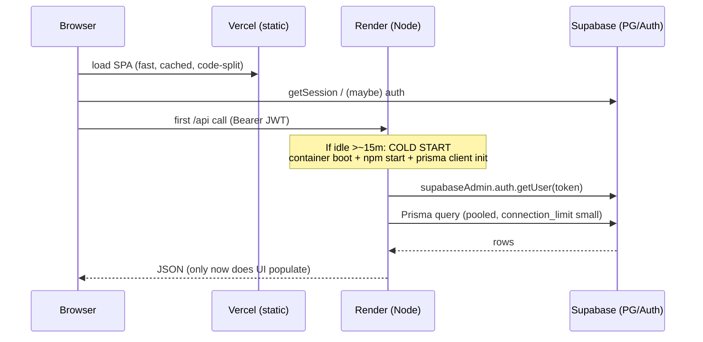

# ABUAD SRC Portal — Technical Audit (Part 4 of 5)

> **Scope of this file:** Database & Frontend Performance · API Scalability · Render Cold Start · Vercel Migration · Neon Migration · Firebase Auth Migration · Storage Migration
> **Prev:** `AUDIT 3.md` · **Next:** `AUDIT 5.md`

---

## 15. Performance Audit

### 15.1 Database performance

| # | Issue | Evidence | Why it hurts at 10k users | Direction (do NOT implement now) |
|---|---|---|---|---|
| DB-1 | **Offset pagination** (`page/limit → skip/take`) on tickets & notifications | `ticketService`, `notificationRoutes` list handlers | `OFFSET` scans+discards rows; deep pages get slower as tables grow | Keyset/cursor pagination on `(created_at, id)` |
| DB-2 | **`count(*)` per list request** for pagination totals | list handlers return total counts | A full count on every list call is expensive on large tables and runs alongside the `findMany` | Approximate counts, cached counts, or drop exact totals |
| DB-3 | **Notification poll → 2× count + findMany every 60s per client** | `NotificationBell.jsx` + `GET /notifications` | Baseline QPS scales with concurrent users, not activity | Push-driven + fetch-on-focus; unread-count endpoint using a cheap indexed query |
| DB-4 | **Index coverage unverified** for hot filters (status, department_id, author_id, created_at, is_public/is_flagged) | Prisma schema `@@index` not fully audited here | Sequential scans on the public board and staff filters | Confirm composite indexes match query shapes |
| DB-5 | **Connection ceiling** — pooled `DATABASE_URL` example uses `pgbouncer=true&connection_limit=1` | `backend/.env.example` | One Prisma connection per instance serializes concurrent queries | Tune `connection_limit`, rely on Supabase pgBouncer, right-size pool |
| DB-6 | **Denormalized counters** (votes/comments) | triggers in `01_post_migration.sql` | *Positive* — avoids counts on hot reads | Keep |

`RECOMMENDATION`: DB-1/DB-2/DB-3 are the ones that bite first; none require leaving Supabase.

### 15.2 Frontend performance (recap + specifics)

- **Good:** route-level code splitting (`App.jsx`), immutable hashed asset caching (`vercel.json`), `AbortController` cancellation, single-ticket in-place patch after vote (`useTickets`). `CONFIRMED`.
- **Watch:** no `manualChunks` in `vite.config.js` (vendor splitting is default-only); `recharts` is heavy but correctly lazy on Analytics; no image downscaling before upload; 60s polling; no API timeout. See `AUDIT 1.md` §4.9.

### 15.3 What is most likely responsible for slow loading

`CONFIRMED`/`LIKELY`, ranked:
1. **Render free-tier cold start** on the first API call (see §17). This is almost certainly the dominant "it hangs on sign-in" symptom.
2. **No API client timeout** → the cold-start hang has no upper bound on the client.
3. **Connection_limit=1** → under any concurrency the first requests queue behind each other while the instance also warms.
4. Everything else (bundle, images) is secondary given the code-splitting already in place.

---

## 16. Scalability Audit / Model

Target load (from the brief): 10,000 registered, ~1,000 concurrent, ~500 concurrent requests, spikes of ~1,000 complaint submissions, large notification bursts, many image uploads.

### 16.1 What fails first (ordered)

1. **Broadcast fan-out** (`AUDIT 3.md` §12.4) — a single "announce to all" is O(students) inside one request on one free instance. **First hard failure** under a notification burst. `LIKELY`.
2. **Single Render free instance** — no horizontal scaling, one Node process, cold starts, ~512 MB. At 500 concurrent requests it saturates. `LIKELY`.
3. **DB connections** — `connection_limit=1` (example) serializes queries; even with pgBouncer, the app-side pool must be sized. `CONFIRMED` config risk.
4. **Notification polling baseline** — 1,000 concurrent clients × 1 req/60s ≈ 17 req/s *just for the bell*, each doing counts. `CONFIRMED` math from `POLL_MS`.
5. **Offset pagination + per-call counts** degrade as `tickets` grows past tens of thousands. `LIKELY`.

### 16.2 Concurrency reality

- **100 concurrent users:** `LIKELY` fine once warm.
- **500 concurrent users:** `POSSIBLE` strain — depends on request mix; polling + counts dominate. Needs load test.
- **1,000 concurrent users:** `LIKELY` requires ≥ paid always-on instance(s) + connection tuning + fan-out offloaded.
- **Spike of 1,000 submissions:** `POSSIBLE` OK for inserts (cheap), but if each triggers staff notifications + push, the fan-out and push sends become the bottleneck.

### 16.3 What must be load-tested (not guessed)

- p95 latency of `GET /tickets` (public board) and `GET /notifications` under 500–1,000 concurrent clients.
- Behaviour of the announcement fan-out at 1k/5k/10k recipients (time, memory, timeout).
- DB connection saturation point at the chosen `connection_limit`.
- Cold-start distribution with and without the keep-alive.

`RECOMMENDATION`: Do not publish capacity numbers without these tests; the architecture review above identifies *where* to point them.

---

## 17. Render Cold Start Analysis

### 17.1 Request path

### 17.2 Why the delay happens `CONFIRMED`

- **Render free plan idles the service after ~15 minutes** of no traffic; the next request pays a full container **cold start** (documented explicitly in `.github/workflows/keepalive.yml` comments: "cold start… takes the better part of a minute").
- On cold start the app must **boot Node, load Express, initialise the Prisma client, and establish the first DB connection** before the first query. The user sees this as a hung sign-in because the **frontend is fast but the first API/auth-backed call blocks**.
- **Keep-alive mitigation exists** (GH Actions cron `*/10m` → `/health`) but is explicitly **best-effort** (GitHub drops scheduled jobs under load; disables after 60 days of no commits). So cold starts still happen. `CONFIRMED`.

### 17.3 Which routes are affected

**All `/api/*` routes** are affected by cold start equally (it's process-level). The first *auth-backed* call after idle is where users feel it (login → `/api/auth/me`, dashboard → `/api/tickets`).

### 17.4 Fastest real fix

`RECOMMENDATION` (ranked): (a) **paid always-on Render instance** eliminates idle cold starts outright; (b) add a **client-side timeout + friendly "waking up" state**; (c) keep the keep-alive as defense-in-depth. Platform migration (below) is a bigger lever with its own trade-offs.

---

## 18. Vercel Migration Feasibility (Express → Vercel Functions)

**Overall: CONDITIONAL.** Most endpoints port cleanly; a few do not. The blockers are stateful/long-running pieces, not the routes themselves.

### 18.1 Portability blockers `CONFIRMED`

| Concern | Present? | Impact on Functions |
|---|---|---|
| Express middleware stack | Yes | Works via a single handler/adapter, but you lose the always-on process model |
| Long-running requests | Yes (announcement fan-out) | **Blocker** — Functions have max durations; fan-out must become a queue/cron |
| In-memory settings cache | Yes (`settingsService`) | Cache won't persist across invocations → more DB reads or external cache |
| In-memory rate-limit store | Yes (`express-rate-limit` default) | Limits fragment per-invocation → need shared store |
| File uploads through API | No (uploads go direct to Supabase) | *Good* — nothing to port |
| WebSockets / streaming | None found | *Good* |
| Background jobs / cron | None in-app (only GH keep-alive) | Would need Vercel Cron for fan-out |
| Persistent DB connections | Prisma pooled | Needs serverless-friendly pooling (Supabase pgBouncer / Prisma Data Proxy / Accelerate) to avoid connection blowups |
| Server-side sessions | None (stateless JWT) | *Good* |

### 18.2 Per-endpoint classification

- **EASY** (stateless, short, JWT-verified): `GET /auth/me`, `PATCH /auth/me`, all `GET /tickets*`, `POST /tickets`, ticket `PATCH`/status/assign/flag, comments, votes, ratings, `GET/PATCH /notifications*`, `POST/DELETE /subscribe`, `GET /departments`, `GET/POST/PATCH/DELETE` departments, `GET /admin/*` reads, `PATCH /admin/users/*`, `GET /admin/maintenance`, `GET /notifications/vapid-public-key`, `/track/:ticketNumber`.
- **MODERATE:** anything depending on the **in-memory settings cache** (maintenance flag reads) → move to per-request DB read or edge cache; **rate-limited** routes → move to shared limiter.
- **DIFFICULT / NOT RECOMMENDED as-is:** **announcement/broadcast creation with in-request push fan-out** → must be refactored to enqueue + background/cron worker before it belongs in a Function.

### 18.3 Verdict

`RECOMMENDATION`: Migrating the CRUD surface to Vercel Functions is feasible and would **co-locate frontend+API and remove Render cold starts**, but you trade for **serverless connection management** and must **re-architect the fan-out** and **externalize rate-limiting/settings cache** first. If the only goal is "fix the slow first load", a **paid always-on Render instance is far less work** and lower risk. Do Vercel migration only if you also want single-vendor deploys and are prepared to do the three refactors above.

---

## 19. Neon Migration Feasibility (Supabase Postgres → Neon)

**Overall complexity: HIGH. Recommendation: NO / not now.**

### 19.1 Supabase-specific coupling `CONFIRMED`

| Dependency | Where | Neon has it? |
|---|---|---|
| `auth.users` schema + `auth.uid()` | RLS policies, FKs (`profiles.id → auth.users`), triggers | **No** (Neon is plain Postgres; no Supabase Auth schema) |
| Trigger on `auth.users` (`on_auth_user_created`) | `handle_new_user()` creates profile | **No** — nothing to hook without Supabase Auth |
| Email-domain trigger on signup | `enforce_signup_email_domain()` | **No** — would move to app logic |
| **RLS as a security boundary** | every table; direct PostgREST access | Neon has RLS, but **no PostgREST/anon-key data API** — you'd lose the browser-direct model entirely |
| Supabase Storage | `ticket-attachments` bucket + `storage.objects` policies | **No** — separate migration |
| Supabase Realtime | not used in-app (polling instead) | N/A |
| DB extensions (`pgcrypto`/`gen_random_uuid`) | seeds/UUIDs | Available on Neon |

### 19.2 Why Neon would NOT fix the identified problems

- The real bottlenecks are **cold start, in-request fan-out, connection sizing, and polling** — none are Supabase-Postgres limitations. `CONFIRMED`.
- Neon's headline features (branching, autoscaling, scale-to-zero) don't address any current pain; **scale-to-zero would add its own cold start** to the DB layer.
- Moving to Neon **forces** replacing Supabase Auth (because `auth.users`/`auth.uid()` disappear) **and** Supabase Storage — i.e., you can't do "just the database" cleanly. This turns a DB swap into a full re-platform. `CONFIRMED` from the coupling table.

`RECOMMENDATION`: **Stay on Supabase Postgres.** Revisit Neon only if you deliberately decide to leave the entire Supabase ecosystem for other reasons.

---

## 20. Firebase Auth Migration Feasibility (Supabase Auth → Firebase)

**Overall: NO technical justification identified from the repository.**

### 20.1 Depth of Supabase Auth coupling `CONFIRMED`

- **Backend token verification** uses `supabase.auth.getUser(token)` in `requireAuth`.
- **Identity linkage:** `profiles.id` is a FK to `auth.users.id`; the whole data model keys off the Supabase user id.
- **RLS** everywhere uses `auth.uid()`.
- **Signup→profile** and **email-domain** enforcement are **DB triggers on `auth.users`**.
- **Password reset / email verification** are Supabase flows wired in `AuthContext`.

### 20.2 What Firebase would force you to rebuild

- Replace `getUser()` verification with Firebase Admin token verification in `requireAuth`.
- Replace **all** `auth.uid()` RLS predicates (Firebase UID isn't known to Postgres) → either push all authz into the app (lose direct-PostgREST/RLS model) or sync Firebase UIDs into Postgres.
- Recreate the **signup→profile** trigger and **email-domain** enforcement in application code (no `auth.users` to trigger on).
- Re-implement password reset / email verification / session handling on the client.

### 20.3 Verdict

Supabase Auth is **cleanly integrated and already verified server-side**; there is no capability the app uses that Firebase provides better here. **No technical justification identified from the repository.** (If a future requirement were phone-auth or a specific Firebase-only provider, revisit — but nothing in the repo indicates that.)

---

## 21. Storage Migration Analysis (Supabase Storage vs Cloudinary vs Cloudflare R2)

Base numbers (from the brief + code): ≤5 images/ticket, ≤5 MB each (bucket-enforced), image types only, ~10k students. No transformations used today.

| Factor | Supabase Storage (current) | Cloudinary | Cloudflare R2 (+Workers/Images) |
|---|---|---|---|
| Fit for volume | ✅ sufficient | ✅ | ✅ |
| Privacy (per-file authz) | ⚠️ **public bucket today**; can switch to private + signed URLs | ✅ signed/auth | ✅ signed URLs |
| Upload security | ✅ MIME+size enforced at bucket; per-user folder RLS | ✅ (needs signed upload preset) | ✅ (needs presigned PUT) |
| Transformations/thumbnails | ❌ none used | ✅ best-in-class | ⚠️ via Images/Workers |
| Bandwidth cost at scale | included w/ Supabase plan | egress + transform costs | ✅ **zero egress** (R2's main advantage) |
| Implementation change | **none** (already integrated) | moderate rewrite of `uploads.js` + delete/lifecycle | moderate rewrite + presign endpoint |
| Orphan lifecycle | needs a cleanup job either way | Cloudinary admin API | needs lifecycle rules |

### 21.1 Verdict — CONDITIONAL

- **Keep Supabase Storage** and fix the two real problems in place: **(1) make the bucket private + serve via signed URLs** (closes the privacy gap), **(2) add a server-side orphan cleanup / transactional attach**. This gives ~90% of the benefit with near-zero migration risk. `RECOMMENDATION`.
- **Choose Cloudinary** only if you actually need on-the-fly transformations/thumbnails/optimization (you currently do none). It would also solve the "no client-side downscaling" bandwidth concern by transforming server-side.
- **Choose R2** if **egress/bandwidth cost** becomes the dominant factor at scale (zero-egress is its edge), accepting you build presigned uploads + lifecycle yourself.
- There is **no urgency** to migrate storage; it's a privacy/lifecycle fix, not a capacity problem.

*Continued in `AUDIT 5.md` — Security Findings, Reliability, Accessibility, SEO/PWA quality, Testing, Deployment, Architecture Recommendation, Prioritized Remediation, Open Questions, and Production-Readiness Score.*
