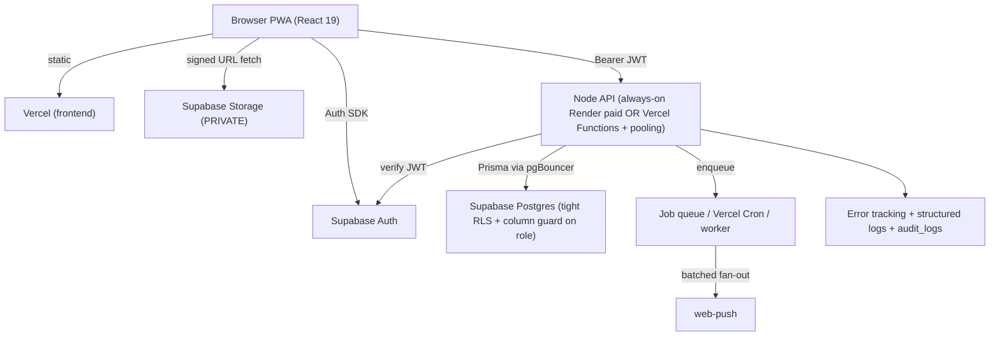

# ABUAD SRC Portal — Technical Audit (Part 6 of 6)

> **Scope of this file:** Testing · CI/CD & Deployment · Final Architecture Assessment (A–F) · Scalability Model · Prioritized Remediation Plan · Open Questions / Unknowns · Final Production-Readiness Score
> **Prev:** `AUDIT 5.md`

---

## 32. Testing Audit

`CONFIRMED` — searched both workspaces for test tooling and specs.

| Test type | Present? | Evidence |
|---|---|---|
| Unit tests | ❌ | No `jest`/`vitest`/`mocha` in either `package.json`; no `*.test.*` / `*.spec.*` files |
| Integration tests | ❌ | none |
| API tests | ⚠️ smoke only | `backend/scripts/smoke-routes.mjs` (route reachability smoke script), `backend/scripts/check-db.mjs` (DB connectivity) — **not assertions/CI tests** |
| Component tests | ❌ | no `@testing-library/*` |
| E2E tests | ❌ | no Playwright/Cypress |
| Security tests | ❌ | none |
| DB/RLS tests | ❌ | none (this is notable given the P0 lives in RLS) |

- **Testing framework:** none configured. **Coverage:** 0% (no runner). `CONFIRMED`.
- **Most critical untested workflows:** (1) **RLS enforcement** — a policy test would have caught P0-1; (2) auth/role guards on every endpoint; (3) ticket state-machine transitions; (4) ownership/IDOR on ticket read/update/delete; (5) broadcast fan-out behaviour.
- `RECOMMENDATION` (do NOT build now): add Vitest + Supertest for API/authz, and a small pgTAP/SQL harness (or seeded Supabase test project) to assert RLS — especially "student cannot change own role" and "student cannot read another's private ticket."

---

## 33. CI/CD & Deployment Audit

Sources: `.github/workflows/keepalive.yml`, `render.yaml`, `frontend/vercel.json`, root/backends/frontend `package.json`, `PROD.md`, `SETUP.md`.

### 33.1 What exists

- **Frontend:** Vercel (Git-integrated; build via Vite). SPA rewrite + cache headers in `vercel.json`. `CONFIRMED`.
- **Backend:** Render blueprint `render.yaml` — `rootDir: backend`, `npm ci`, `npm start`, health check `/health`, secrets `sync:false`. `CONFIRMED`.
- **Keep-alive:** GitHub Actions cron pinging `/health` every 10 min. `CONFIRMED`.
- **Prisma:** `postinstall` runs `prisma generate`; migrations via `prisma migrate` using `DIRECT_URL`. `CONFIRMED`.

### 33.2 Gaps / risks `CONFIRMED`

- **No CI test/lint/build gate.** The only workflow is keep-alive. Nothing runs ESLint/build/tests on PRs → regressions can ship. P2.
- **RLS/trigger SQL applied by hand** (`prisma/sql/*.sql`) — no automation guarantees prod parity (P2-5). **This is the single most dangerous deployment gap** because security lives in that SQL.
- **No migration deployment automation** tied to release; **no rollback strategy** documented beyond redeploying a previous build.
- **Prod/dev separation:** relies on separate env values; verify separate Supabase projects for dev/prod (`UNABLE TO VERIFY` from repo).
- **No preview-environment DB isolation** noted (`UNABLE TO VERIFY`).

`RECOMMENDATION`: add a CI workflow (lint + build + tests + `prisma migrate diff` check), and make policy/trigger SQL part of an automated, idempotent, verified deploy step.

---

## 34. Final Architecture Assessment

### A. Should Render be removed?
**CONDITIONAL.** Render itself is fine; the **free plan's idle cold start** is the problem. Removing Render is *not* required — a **paid always-on instance** fixes the primary symptom immediately with near-zero risk. Remove Render only if you consolidate onto Vercel Functions for other reasons (single-vendor, co-location) **and** complete the refactors in §B. `Evidence:` cold-start analysis (`AUDIT 4.md` §17), keep-alive comments.

### B. Should the Node API move to Vercel Functions?
**CONDITIONAL.**
- **Move (EASY):** the entire CRUD surface — auth/me, tickets (all), comments, votes, ratings, notifications read/subscribe, departments, admin reads, user role/status, track, vapid key.
- **Refactor first (MODERATE):** externalize the **in-memory settings cache** and **rate-limit store**; adopt **serverless-safe DB pooling** (Supabase pgBouncer / Prisma Accelerate).
- **Do NOT move as-is (DIFFICULT):** **announcement broadcast fan-out** (long-running) → convert to enqueue + Vercel Cron/worker before it can live in a Function.
- **Net:** feasible and attractive for co-location, but it's a project, not a toggle. If the goal is only "fix slowness," prefer paid Render. `Evidence:` `AUDIT 4.md` §18.

### C. Should Supabase PostgreSQL be replaced with Neon?
**NO (CONDITIONAL at most).** The app is coupled to `auth.users`, `auth.uid()` RLS, auth triggers, and Supabase Storage. Neon offers none of the Supabase Auth/PostgREST/Storage surface, so a DB-only swap is not clean, and **Neon wouldn't fix any identified bottleneck** (cold start, fan-out, connection sizing, polling). `Evidence:` `AUDIT 4.md` §19.

### D. Should Supabase Auth be replaced with Firebase Auth?
**NO.** **No technical justification identified from the repository.** Supabase Auth is verified server-side, linked via `profiles.id → auth.users`, and drives all RLS + signup/domain triggers. Firebase would force rebuilding token verification, RLS identity, and the signup/domain triggers with no functional gain observed. `Evidence:` `AUDIT 4.md` §20.

### E. Should Supabase Storage be replaced?
**CONDITIONAL.** Volume fit is fine. The real issues — **public bucket (privacy)** and **orphan lifecycle** — are fixable **in place** (private bucket + signed URLs + cleanup job). Move to **Cloudinary** only if you need transformations, or **R2** if egress cost dominates. Not urgent. `Evidence:` `AUDIT 3.md` §11, `AUDIT 4.md` §21.

### F. Best architecture for ~10,000 students (recommended target)

Key changes vs today (all evidence-based, none implemented here):
1. **Fix P0-1** (protect `profiles.role`) + confirm write `with check` on all user-writable tables.
2. **Make Storage private** + signed URLs; add orphan cleanup.
3. **Offload broadcast fan-out** to a queue/cron worker.
4. **Always-on API** (paid Render or Functions + pooling) to kill cold starts.
5. **Notifications:** push-driven + fetch-on-focus (drop fixed 60s polling), add unread-count endpoint.
6. **Shared rate-limit store**, **audit logging**, **error tracking**, **CI gate**, **RLS in versioned migrations**.
7. Keep **Supabase Auth + Postgres + Storage** — no migration needed.

---

## 35. Scalability Model (bottlenecks to load-test)

| Load dimension | Likely first constraint | What to test | Direction |
|---|---|---|---|
| 10,000 registered | storage growth, notification table growth | table sizes, index hit rates | keyset pagination, retention/archival |
| 1,000 concurrent users | notification polling baseline + single instance | p95 of `GET /notifications`, `GET /tickets` | push-driven notifications, ≥1 always-on/autoscale |
| 500 concurrent requests | Node single process + DB connections | connection saturation at chosen `connection_limit` | pooling (pgBouncer/Accelerate), autoscale |
| 1,000 complaint spike | inserts cheap; per-insert notifications | write throughput + notification amplification | batch notifications, async |
| Large image uploads | Storage bandwidth (direct-to-Supabase) | egress, upload success under concurrency | client downscale, CDN if needed |
| Notification bursts | **broadcast fan-out (O(recipients) in-request)** | fan-out time/memory at 1k/5k/10k | **queue + batched workers (highest priority)** |

`RECOMMENDATION`: don't publish capacity numbers without these tests. Architecturally, the **fan-out** and **single-instance/connection** limits fail before raw DB capacity does.

---

## 36. Prioritized Remediation Plan

| Priority | Issue | Severity | Area | Evidence | Recommended Action |
|---|---|---|---|---|---|
| **P0** | `profiles.role` writable by owner via RLS → privilege escalation | Critical | RLS/AuthZ | `01_post_migration.sql` L324–326 | Column REVOKE and/or role-change trigger; block `role`/`is_active` writes from `authenticated`; add RLS test |
| **P1** | Cross-user writes / `author_id` spoofing via PostgREST | High | RLS | `01`/`04` write policies | Add `with check (author_id = auth.uid())` on INSERT; owner/staff on UPDATE/DELETE for all user-writable tables |
| **P1** | Anonymity not DB-enforced (author_id readable) | High | RLS/Privacy | `01` L331–337 | View/column protection or API-only ticket reads |
| **P1** | Public storage bucket exposes evidence | High | Storage/Privacy | `02_storage.sql` L21–32 | Private bucket + signed URLs |
| **P1** | Admin may assign `SUPER_ADMIN` (verify) | High | AuthZ | `adminRoutes.js`, `roleSchema` | Gate SUPER_ADMIN assignment to `requireSuperAdmin`; forbid self-elevation |
| **P1** | Broadcast fan-out in-request (won't scale) | High | Scalability | announcements route + `pushService` | Queue/cron worker, batched sends |
| **P2** | No frontend security headers (CSP/HSTS/…) | Medium | Security headers | `frontend/vercel.json` | Add `headers` block |
| **P2** | RLS/trigger SQL applied manually (drift) | Medium | Deployment | `prisma/sql/*` | Versioned/idempotent, verified in CI |
| **P2** | No CI test/lint/build gate | Medium | CI/CD | `.github/workflows` | Add CI pipeline |
| **P2** | No audit logging / error tracking / structured logs | Medium | Observability | deps + routes | Wire `audit_logs`, add Sentry + logger + request IDs |
| **P2** | Account enumeration (`/check-email`) | Medium | Auth | `authRoutes.js` | Generic responses |
| **P2** | Render free-tier cold start (UX) | Medium | Perf/Infra | `keepalive.yml` | Paid always-on; client timeout + "waking" UI |
| **P2** | `is_staff()` excludes SUPER_ADMIN | Medium | AuthZ correctness | `01`/`04` | Include SUPER_ADMIN |
| **P2** | Session in localStorage on shared devices | Medium | Auth | `supabase.js` | Idle timeout, prominent logout, CSP |
| **P3** | No API timeout/retry | Low | Reliability | `lib/api.js` | AbortController timeout + retry (idempotent GET) |
| **P3** | Duplicate submit / no idempotency | Low | Reliability | `POST /tickets` | Idempotency key |
| **P3** | No optimistic locking (concurrent staff edits) | Low | Reliability | ticket mutations | `version`/`updated_at` guard |
| **P3** | Dead push subscriptions not pruned (verify) | Low | Notifications | `pushService` | Prune on 404/410 |
| **P3** | MIME allowlist drift | Low | Storage | client/bucket/backend | Single source of truth |
| **P3** | supabase-js version drift | Low | Deps | package.json ×2 | Align versions |
| **P3** | No global error boundary | Low | Frontend | `frontend/src` | Add boundary in Suspense |
| **P3** | Offset pagination + per-call counts | Low→Med at scale | DB perf | list handlers | Keyset pagination; cheaper counts |
| **P3** | No client image downscaling | Low | Perf/Storage | `AttachmentPicker`/`uploads.js` | Downscale before upload |
| **P3** | `audit_logs` unused | Low | Observability | schema | Populate on privileged actions |

---

## 37. Open Questions / Unknowns (Unable to verify from the repository)

1. **Is PostgREST actually reachable with the anon key in this Supabase project?** (Determines whether P0-1/P1-x are *live* or *latent*.) Very likely yes given `supabase-js` usage, but confirm project API settings.
2. **Exact contents of `roleSchema`** — does it permit `SUPER_ADMIN`? (Confirms/denies P1-4.)
3. **Were all `prisma/sql/01..05` files applied to prod, in order?** (P2-5.) No automated proof.
4. **Do all user-writable tables have `with check` on INSERT/UPDATE?** (P1-1.) Needs a full policy dump.
5. **Supabase Auth email-confirmation setting** (dashboard, not in repo).
6. **Separate Supabase projects for dev/preview/prod?**
7. **Does `pushService` prune on 404/410?** (Reliability.)
8. **Are all multi-write ticket operations wrapped in transactions?** (Partial confirm.)
9. **Lighthouse/axe scores** — not run in this audit.
10. **Prisma unique-constraint error passthrough** — does it leak field names? (Minor.)

---

## 38. Final Production-Readiness Score

**Score: 58 / 100 — "Solid foundation, not yet production-hardened."**

| Dimension | Score | Rationale |
|---|---:|---|
| Architecture & code structure | 8/10 | Clean 2-tier, server-side authz, services layer, Zod, transactions |
| Authentication | 7/10 | Server-verified JWT, domain trigger; enumeration + localStorage caveats |
| **Authorization / RLS** | **3/10** | API authz strong, but **P0 role-escalation via RLS** + unconfirmed write policies |
| Data validation | 8/10 | Zod everywhere; a few bounds to confirm |
| Storage security | 4/10 | Per-user write isolation good; **public bucket** + orphans |
| Notifications | 5/10 | Works; **fan-out won't scale**, polling baseline |
| Performance (frontend) | 7/10 | Code splitting, caching, AbortController |
| Performance (backend/DB) | 5/10 | Cold start, connection_limit, offset pagination |
| Scalability | 4/10 | Single free instance + in-request fan-out |
| Reliability | 5/10 | Transactions yes; no idempotency/locking/timeout |
| Security headers | 4/10 | Helmet on API; none on frontend |
| Observability | 2/10 | No error tracking/audit/structured logs |
| Testing | 1/10 | None (smoke scripts only) |
| CI/CD & deployment | 4/10 | Vercel/Render wired; manual RLS SQL, no CI gate |
| PWA | 8/10 | Correct SW hygiene, installable |
| Accessibility | 6/10 | Reasonable base; unverified modals/labels |

**Weighted overall: 58/100.**

**Why not higher:** one **Critical privilege-escalation** in RLS, **zero automated tests**, **no observability/audit trail**, **free-tier cold starts**, and a **broadcast path that won't scale**.

**Why not lower:** the fundamentals are genuinely good — authorization is enforced at the correct (server) boundary, inputs are validated with Zod, the DB uses triggers/transactions/denormalized counters thoughtfully, secrets are split correctly (no service-role key in the browser), and the PWA/service-worker deliberately avoids caching private data.

**Fastest path to ~80/100 (no migrations required):** fix **P0-1**, confirm/tighten write RLS (**P1-1/1-2**), make **Storage private** (**P1-3**), **offload fan-out** (**P1-5**), move the API to an **always-on instance**, and add **CI + error tracking + audit logging**. None of these require leaving Supabase, Render→Vercel, Postgres→Neon, or Supabase Auth→Firebase.

---

### Report index
- `AUDIT 1.md` — Executive Summary · Architecture · Repository Structure · Frontend
- `AUDIT 2.md` — Backend · Authentication · Authorization/RBAC · Database · RLS
- `AUDIT 3.md` — Complaint Workflow · Storage · Notifications · PWA · API Security
- `AUDIT 4.md` — Performance · Scalability · Render Cold Start · Migrations (Vercel/Neon/Firebase/Storage)
- `AUDIT 5.md` — Security Findings · Headers · Rate Limiting · Validation · Secrets · Errors · Observability · Reliability · Accessibility · SEO/PWA
- `AUDIT 6.md` — Testing · Deployment · Final Architecture Assessment · Scalability Model · Prioritized Remediation · Open Questions · Score

*End of audit. No application source, dependencies, infrastructure, or configuration were modified during this reconnaissance.*
